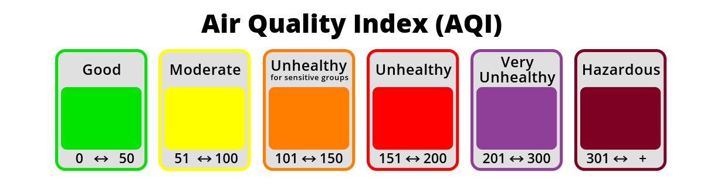
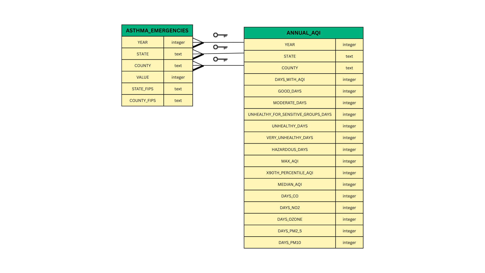

# U.S Asthma and Air Quality Database (2020–2022)

This project explores the relationship between air quality and asthma-related emergency room visits in the United States from 2020 to 2022. It investigates whether counties experiencing poor air quality—with most extreme values due to wildfire activity—also saw elevated rates of asthma emergencies.



### Data Sources

-   **EPA Outdoor Air Quality Data**\
    <https://www.epa.gov/outdoor-air-quality-data>
    -   Pre-generated data files can be downloaded by going to the Annual Summary Data table, AQI by County column, and clicking on desired years' zip file.
-   **CDC Environmental Public Health Tracking Network**\
    <https://ephtracking.cdc.gov/DataExplorer/>
    -   Desired data is queried via the Query Panel
        -   Under 'Content'
            -   Select 'Asthma'
            -   Select 'Emergency Department Visits For Asthma'
            -   Select 'Annual Number of Emergency Department Visits for Asthma'
        -   Under 'Geography Type' select 'National By County'
        -   Under 'Time' select 2020, 2021, and 2022.
    -   Download file

### Methods

-   Data cleaning and transformation using R (`tidyverse`, `janitor`, `lubridate`)
-   Environment managed with `renv`
-   Data loaded into a DuckDB database
-   Analysis conducted with SQL queries in VS Code
-   Key query: identifying counties with the highest asthma ER visits and comparing them to peak AQI levels during wildfire-heavy years

### File and Database Structure

This repository contains all scripts, data, and resources used to create a asthma-AQI database and explore the relationship between air quality and asthma emergency room visits in U.S. counties from 2020–2022. The repository was developed for the course **EDS 213: Data Management** at **UC Santa Barbara**.

------------------------------------------------------------------------

#### Files

```         
├── .gitignore
├── .Rprofile
├── create-database-asthma-emergencies.sql     # SQL schema and data loading script
├── data/
│   ├── raw/                                    # Original datasets (unmodified)
│   │   ├── annual_aqi_by_county_2020.csv
│   │   ├── annual_aqi_by_county_2021.csv
│   │   ├── annual_aqi_by_county_2022.csv
│   │   ├── annual_asthma_emergencies_county_2020_2022.csv
│   │   └── asthma_metadata.htm
│
│   └── processed/                              # Cleaned and final analysis files
│       ├── annual_aqi_clean.csv
│       ├── asthma_emergencies_clean.csv
│       └── asthma_aqi_data_2020_2022.duckdb    # Final DuckDB database
│
├── data_exploration_and_cleaning.Rmd          # R Markdown for data cleaning and EDA
├── dependencies.txt                            # Environment and package requirements
├── eds_213_database_proj.Rproj                 # RStudio project file
├── query.sql                                   # Final SQL analysis query
├── README.md                                   # Project overview and documentation
├── renv/                                       # R environment folder (not tracked by Git)
└── renv.lock                                   # Lockfile with exact R package versions
```

------------------------------------------------------------------------

#### Database Schema



## Author

Kaiju Morquecho

Master of Environmental Data Science Student

Bren School of Environmental Science and Management

[kaimorquecho\@bren.ucsb.edu](mailto:kaimorquecho@bren.ucsb.edu){.email}

## Acknowledgments

This project was completed as part of EDS 213: Data Management, a graduate course at the Bren School of Environmental Science & Management, UC Santa Barbara.\
Special thanks to Professors Greg Janée and Julien Brun, and Annie Adams for their instruction and guidance.
